# 1. Projeto II - Fundamentos Data Science I

<!-- TOC -->

- [1. Projeto II - Fundamentos Data Science I](#1-projeto-ii---fundamentos-data-science-i)
    - [1.1. Notas](#11-notas)
    - [1.2. Perguntas Feitas](#12-perguntas-feitas)
    - [1.3. Limpeza dos dados](#13-limpeza-dos-dados)
    - [1.4. Analises e Resultados](#14-analises-e-resultados)
    - [1.5. Links uteis](#15-links-uteis)

<!-- /TOC -->

## 1.1. Notas

Todas as analises aqui presentes são resultados do dataset disponibilizado pelo curso de Fundamentos de Data Science I da Udacity. Essas analises são feitas de forma descritiva, apenas para estudo e não devem ser considerados como resultados fieis, para tal devem serem feitas outras analises e recomenda-se a utilização do método baseados em deep learning para definir corretamente os valores faltantes, que podem ser oriundos de erros humanos.

- O dataset utilizado foi titanic-data-6.csv e sua versão editada titanic_edited.csv
- As [perguntas feitas](#12-perguntas-feitas) estão na seção seguinte.
- As informações sobre a limpeza dos dados estão na seção [1.3](#13-limpeza-dos-dados).
- As análises e resultados finais se encontram na seção [1.4](#14-analises-e-resultados).
- A ultima seção [1.5](#15-links-uteis) contem links uteis de sites com informações que me ajudaram a completar o projeto.

## 1.2. Perguntas Feitas

- Adultos tem uma maior taxa de sobrevivência do que as demais categorias?
    + Como temos categorias de idade e a chance de um adulto sobreviver normalmente é maior é possível verificar quantos adultos sobreviveram por classe e analisar a diferença das demais categorias que sobreviveram.

- A probabilidade de ser adulto e estar na primeira classe?
    + Com a separação entre as três classes de passageiro e as categorias de idade, é possível investigar qual a probabilidade de se estar em qualquer uma das classes.

- A frequência de adultos em comparação as demais categorias de idade no barco.
    + A possibilidade de que existem mais adultos que as demais categorias é clara, mas e sua frequência em comparação as demais.


## 1.3. Limpeza dos dados

O programa responsável por fazer a limpeza dos dados é o arquivo `titanic_dataset_edit.py`, ele é responsável por fazer a maioria das modificações. Algumas modificações o programa não ira fazer pois foi necessário manter os dados no estado correto.

- Primeiro o programa apresenta as colunas, seus tipos e quantidade de dados que cada coluna possui. Com isso podemos analisar colunas com valores faltantes e colunas que não irão ser uteis para o projeto;
- Em seguida e verificada quantos itens únicos cada coluna tem;
- As colunas `PassengerId` e `Cabin` são removidas. A primeira contém apenas um índice que já é gerado ao se carregar o csv, a segunda tem apenas o código de cada cabine onde o passageiro dormiu e não é util para as analises;
- A coluna `Pclass` é renomeada para `passenger_class` para melhorar a visualização, demais nomes são mantidos;
- Todas as colunas são renomeadas para ficaram em letras em minusculo e alterar a separação entre palavras para sublinhado. Em seguida os nomes são revisados para verificar se estão corretos;
- É contado quantos valores de idade nulos existem por classe de passagem, é feito o calculo da média e aplicada a esses valores em branco para terem uma estimativa da idade;
- É criada uma nova coluna com a categoria da idade de cada passageiro, sendo: `Crianças` para pessoas com menos de 12 anos, `Adolescente` para pessoas com mais de 12 anos e menos de 18 anos e `Adulto` para todos que tiverem idade maior que 18 anos;
- Ao final é gerado um novo dataset contendo os registros editados.


## 1.4. Analises e Resultados

**Tabela 1** -
| passenger_class | age_category | survived |
|----------------:|--------------|:--------:|
| 1               | Adolescente  | 11       |
| 1               | Adulto       | 122      |
| 1               | Criança      | 3        |
| 2               | Adolescente  | 6        |
| 2               | Adulto       | 64       |
| 2               | Criança      | 17       |
| 3               | Adolescente  | 13       |
| 3               | Adulto       | 86       |
| 3               | Criança      | 20       |
| total           | -            | 342      |

```
Total de passageiros por classe:
Total de pessoas da 1(a) classe no titanic: 216.
Total de pessoas da 2(a) classe no titanic: 184.
Total de pessoas da 3(a) classe no titanic: 491.
Total de sobreviventes: 891.

Porcentagem de sobreviventes por classe:
Porcentagem de sobreviventes da 1(a) classe: 62.96%.
Porcentagem de sobreviventes da 2(a) classe: 47.28%.
Porcentagem de sobreviventes da 3(a) classe: 24.24%.
Porcentagem de sobreviventes do naufrágio: 38.38%.

Porcentagem por classes de sobreviventes:
Porcentagem da 1(a) classe: 39.77%.
Porcentagem da 2(a) classe: 25.44%.
Porcentagem da 3(a) classe: 34.80%.
Total de sobreviventes: 342.
```

A *Tabela 1* demonstra que a grande maioria dos sobreviventes do naufrágio do Titanic, em todas as classes de passageiros, são adultos, sendo a grande maioria pertencentes a primeira classe. Esses dados consideram que 30 pessoas não identificadas da primeira classe são da categoria adulta, por intermédio da substituição dos Nas pela de média entre a quantidade de passageiros dessa classe. Ainda sabemos que o total desses sobreviventes somam 342 passageiros.

A *Figura 1* ajuda a esclarecer visualmente a porcentagem de sobreviventes entre cada categoria e sua classe de passageiro.

**Figura 1** - Gráfico de sobreviventes por classe e categoria de idade.

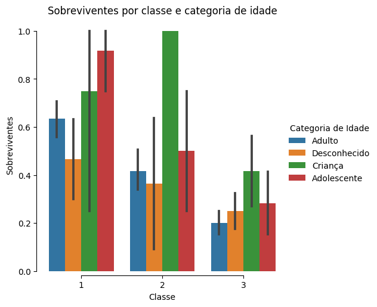

**Figura 2** - Gráfico de contagem de passageiros por classe e categoria de idade.

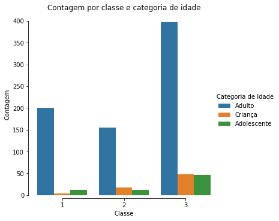

Na *Figura 2* observa-se que a população de passageiros era constituída, na maior parte, por adultos. Para todas as categorias de idade, observa-se maior discrepância de valores na terceira classe em relação as demais. Observa-se ainda que a população de crianças na primeira classe foi a menor entre as classes.

**Figura 3** - Gráfico de caixa de categoria de idade por classe.

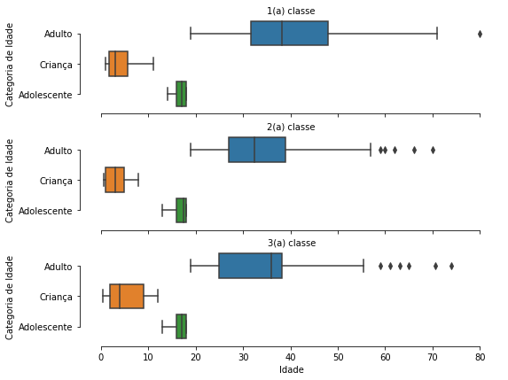

O mesmo é observado na *Figura 3*, com informações adicionais de que existem outliers na categoria adultos em todas as classes (*Figura 11*). Observa-se também que existe pouca variabilidade dentro das categorias, exceto para criança na primeira e terceira classe, adolescente na segunda classe e adultos na terceira classe.

**Figura 4** - Gráfico de caixa entre idade de passageiros adultos e classe social.

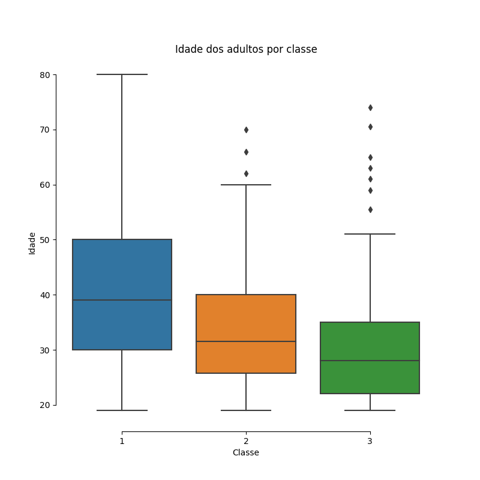

**Figura 5** - Gráfico de frequência da primeira classe.

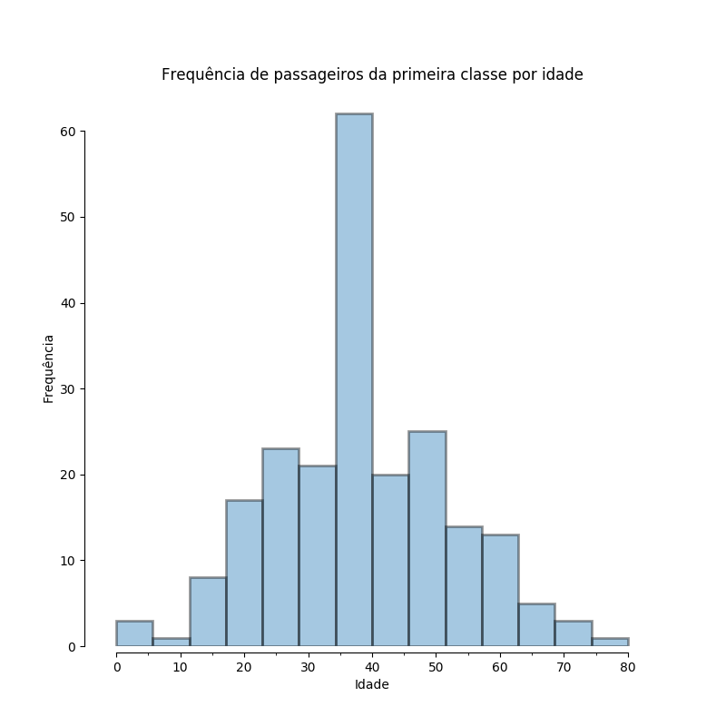

O primeiro gráfico de frequência  *Figura 5* apresenta uma distribuição simétrica e a maior frequência observada é de adultos com idade variando de 35 a 40 anos.

**Figura 6** - Gráfico de frequência da segunda classe.

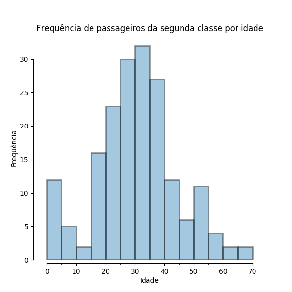

No segundo e terceiro gráficos de frequência *Figuras 6 e 7* observam-se assimetrias positivas, sendo que no terceiro gráfico a maior frequência de idade varia de 35 a 40 anos e pertence a categoria adulta.

**Figura 7** - Gráfico de frequência da terceira classe.

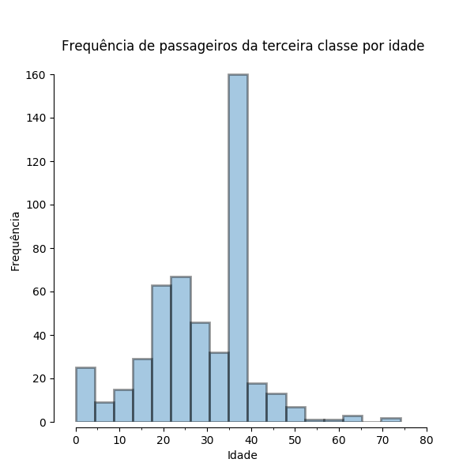

**tabela 2** -
| passenger_class | sex    | total | survived |
|----------------:|--------|:-----:|:--------:|
| 1               | female | 94    | 91       |
| 1               | male   | 122   | 45       |
| 2               | female | 76    | 70       |
| 2               | male   | 108   | 17       |
| 3               | female | 144   | 72       |
| 3               | male   | 347   | 47       |

A *Tabela 2* mostra que existe mais homens e mulheres na terceira classe, como observado anteriormente nas *Figuras 2 e 8*. A maioria dos sobreviventes são do gênero feminino, *Tabela 4*, sendo que a primeira e segunda classe quase todas as passageiras sobreviveram. Esses dados podem ser reafirmados pela *Figura 8*, que mostra a contagem de passageiros a bordo, com uma discrepância de passageiros do gênero masculino na terceira classe.

**Figura 8** - Gráfico de contagem de passageiros por classe e gênero.

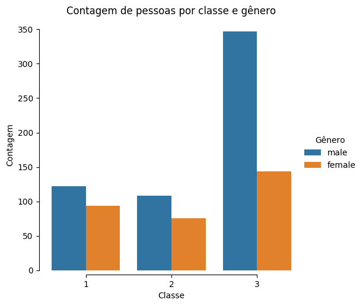

**Tabela 3** -
| passenger_class | total | survived |
|----------------:|:-----:|:--------:|
| 1               | 216   | 136      |
| 2               | 184   | 87       |
| 3               | 491   | 119      |

A *Tabela 3* demonstra que a grande maioria, com o dobro de passageiros da primeira classe pertencia a terceira classe, porém aproximadamente 1/4 sobreviveu, enquanto a primeira classe teve uma sobrevivência maior que 50%.

**Figura 9** - Contagem de passageiros por classe.

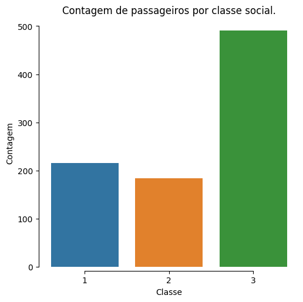

**Tabela 4** -
| sex    | total | survived |
|:-------|:-----:|:--------:|
| female | 314   | 233      |
| male   | 577   | 109      |

A *Tabela 4* demonstra que os passageiros eram majoritariamente do gênero masculino, como também é observado na *Figura 10*, com maior sobrevivência de pessoas do gênero feminino. O que indica que mulheres tiveram uma maior taxa de sobrevivência comparado a homens, o que é esperado em um acidente dessas proporções.

**Figura 10** - Contagem de pessoas por gênero.

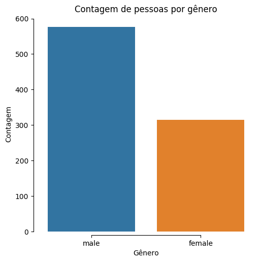

**Tabela 5** -
| age_category | total | survived |
|:-------------|:-----:|:--------:|
| Adolescente  | 70    | 30       |
| Adulto       | 752   | 272      |
| Criança      | 69    | 40       |

A grande maioria dos passageiros era da categoria adulta, com a minoria sendo de crianças e adolescentes (*Figura 11*). Os adultos tiveram a maior taxa de morte devido seu maior número, porém mais de 50% dos adolescentes faleceram no naufrágio, no total 57,97% das crianças, 37,52% dos adultos e 42,86% dos adolescentes sobreviveram como pode ser observado na *Tabela 5*.

**Figura 11** - Contagem de pessoas por categoria de idade.

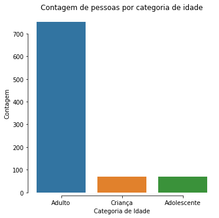


**Tabela 6** -
| age_category | count | mean              | std                | min  | 25%  | 50%  | 75%                | max  |
|--------------|-------|-------------------|--------------------|------|------|------|--------------------|------|
| Adolescente  | 70.0  | 16.57857142857143 | 1.4386882972218642 | 13.0 | 16.0 | 17.0 | 18.0               | 18.0 |
| Adulto       | 752.0 | 35.21651467055594 | 10.613821418618652 | 19.0 | 27.0 | 36.0 | 38.233440860215055 | 80.0 |
| Criança      | 69.0  | 4.770579710144927 | 3.390390348885739  | 0.42 | 2.0  | 4.0  | 8.0                | 12.0 |

A *Tabela 6* mostra a descritiva das categorias de idade, No geral, a idade média dos adolescentes é de, aproximadamente, 17 anos (desvio de 1.44), mínimo de 13 anos e máximo de 18 anos; os adultos possuem, aproximadamente, 35 anos (desvio de 10.61), com mínimo de 19 anos e máximo de 80 anos; e as crianças possuem a idade média de, aproximadamente, 5 anos (desvio de 3.39), com mínimo de 0.42 meses e máximo de 12 anos. A *Tabela 7* separa a descritiva das categorias de idade entre as classes de passageiro, por ela é possível verificar que adultos da primeira classe são os mais velhos, com idade media de 40 anos, já adolescentes tem pouca variação na média de idade por classe, assim como na categoria infantil.

**Tabela 7** -
| age_category | passenger_class | count | mean               | std                | min  | 25%   | 50%                | 75%                | max  |
|--------------|-----------------|-------|--------------------|--------------------|------|-------|--------------------|--------------------|------|
| Adolescente  | 1               | 12.0  | 16.666666666666668 | 1.3026778945578592 | 14.0 | 16.0  | 17.0               | 18.0               | 18.0 |
| Adolescente  | 2               | 12.0  | 16.75              | 1.712255291076124  | 13.0 | 16.0  | 17.5               | 18.0               | 18.0 |
| Adolescente  | 3               | 46.0  | 16.51086956521739  | 1.423958217375397  | 13.0 | 16.0  | 17.0               | 18.0               | 18.0 |
| Adulto       | 1               | 200.0 | 40.20251612903226  | 12.184442955973504 | 19.0 | 31.75 | 38.233440860215055 | 48.0               | 80.0 |
| Adulto       | 2               | 155.0 | 34.3810828997572   | 10.599676082201874 | 19.0 | 27.0  | 32.5               | 39.0               | 70.0 |
| Adulto       | 3               | 397.0 | 33.030851277051006 | 8.81627325913373   | 19.0 | 25.0  | 36.0               | 38.233440860215055 | 74.0 |
| Criança      | 1               | 4.0   | 4.48               | 4.530077262034281  | 0.92 | 1.73  | 3.0                | 5.75               | 11.0 |
| Criança      | 2               | 17.0  | 3.4899999999999998 | 2.5219659989777816 | 0.67 | 1.0   | 3.0                | 5.0                | 8.0  |
| Criança      | 3               | 48.0  | 5.248333333333334  | 3.510292667275633  | 0.42 | 2.0   | 4.0                | 9.0                | 12.0 |

A tabela 7 é uma descritiva dos passageiros agrupada por categoria de idade

**Tabela 8**
| passenger_class | embarked | fare_mean          | total |
|----------------:|:--------:|--------------------|:------|
| 1               | C        | 104.71852941176469 | 85    |
| 1               | Q        | 90.0               | 2     |
| 1               | S        | 70.36486220472443  | 127   |
| 2               | C        | 25.358335294117644 | 17    |
| 2               | Q        | 12.35              | 3     |
| 2               | S        | 20.327439024390245 | 164   |
| 3               | C        | 11.214083333333337 | 66    |
| 3               | Q        | 11.183393055555557 | 72    |
| 3               | S        | 14.64408300283288  | 353   |

Na *Tabela 8* podemos ver uma separação dos valores médios das passagens em cada posto de embarque do Titanic. Sendo C (Cherbourg), Q (Queenstown) e S (Southampton). As passagens mais caras da primeira classe foram compradas em Cherbourg (*Figura 13*), totalizando 168 passageiros sendo a maioria da primeira classe (*Figura 12*), sendo que em Southampton apresentou um maior movimento de passageiros. Houve pouquíssimos embarques da primeira e segunda classe em Queenstown, cinco passageiros apenas. Pela *Figura 12* pode-se observar que existem outliers com relação ao valor da passagem, como existem passagens com valores altos que permitiam entrada de mais de um passageiro. Como o banco de dados possuia dados faltantes, suspeita-se que esses outliers sejam passagens que abrangem mais passageiros que não estavam contidos no dataset.

**Figura 12** - Gráfico de caixa entre classe de passageiros e taxa da passagem.

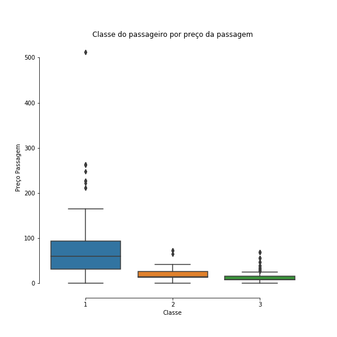

**Figura 13** - Gráfico de barra com local de embarque e classe do passageiro.

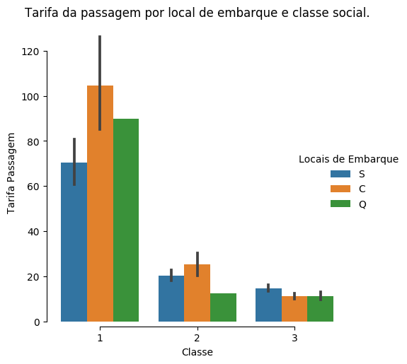

## 1.5. Links uteis

 - [Change Figure Size](https://stackoverflow.com/questions/31594549/how-do-i-change-the-figure-size-for-a-seaborn-plot/31597278)
- [Save Figure in Seaborn](https://stackoverflow.com/questions/33616557/barplot-savefig-returning-an-attributeerror)
- [Ploting with Seaborn](https://www.kaggle.com/princeashburton/plotting-with-seaborn)
- [Histograms and Density Plots in Python](https://towardsdatascience.com/histograms-and-density-plots-in-python-f6bda88f5ac0)
- [Adjust Ticks in Seaborn](https://github.com/mwaskom/seaborn/issues/568)
- [CSV to Markdown](https://donatstudios.com/CsvToMarkdownTable)
- [Seaborn Tutorial](https://seaborn.pydata.org/tutorial.html)
- [Matplotlib Docs](https://matplotlib.org/contents.html)
- [Pandas Doc](https://pandas.pydata.org/pandas-docs/stable/)
- [Numpy Docs](https://docs.scipy.org/doc/numpy/)