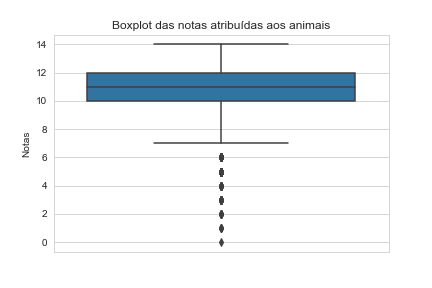
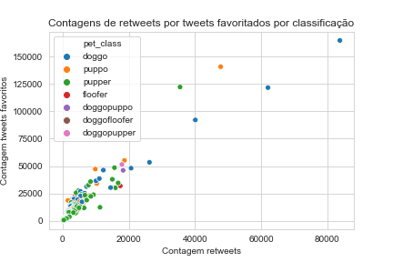
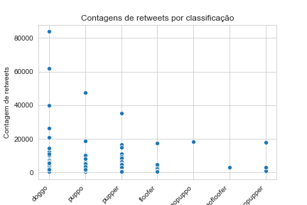
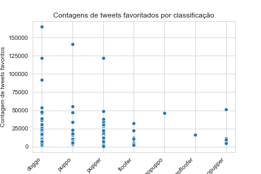
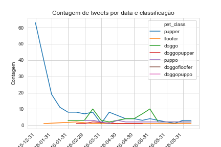

**Código 1** - Descrição de `rating_numerator`.
```python
df_tweets_archive.rating_numerator.describe()
```

**Tabela 1** - Descrição de todos os valores de `rating_numerator`.

 count      1942.00
-------     -------
 mean       12.21
 std        41.94
 min        0.00
 25%        10.00
 50%        11.00
 75%        12.00
 max        1776.00

**Código 2** - Descrição de `rating_numerator` removendo o que são possíveis outliers.
```python
df_tweets_archive[df_tweets_archive.rating_numerator <=15] \
    .rating_numerator.describe()
```
**Tabela 2** - Descrição de valores de `rating_numerator` inferiores a 16.

| count | 1925.00            |
|-------|--------------------|
| mean  | 10.49              |
| std   | 2.19               |
| min   | 0.00               |
| 25%   | 10.00              |
| 50%   | 11.00              |
| 75%   | 12.00              |
| max   | 14.00              |

**Figura 1** - Boxplot com notas atribuídas aos animais.



**Insight**: Neste gráfico podemos verificar depois de remover as notas discrepantes, ou seja superiores a 15, assim removendo outliers (valores que podiam chegar a 1776, sendo que a nota deveria ser até 10 visto que o denominador é 10 mas os usuários como brincadeira classificam os animais com notas a cima desse valor), e com média de 10.49 e desvio de 2.19. Observa-se que existe uma homogeniedade da variância no boxplot, visto que a diferença entre o terceiro quartil e a mediana assim como a diferença entre o primeiro quartil e a mediana parecem ser a mesmas.

---

**Figura 2** - Distribuição de retweets por tweets favoritados por classificação.



**Insight**: Esse é um gráfico de dispersão, entre a contagem de retweets e a contagem de tweets favoritos para cada classificação. Observa-se que a medida que aumenta a contagem de retweets aumenta a contagem de tweets favoritos (o que pode ser devido a maior visibilidade do tweet) e a classe que possui a maior evidência é a classe pupper. Vale salientar que é possível observar que a classe doggo possui observações com maiores números de retweets, consequentemente, maior contagem de tweets favoritos.

---

**Figura 3** - Distribuição de retweets por classificação.



**Insight**: Por este gráfico é possível verificar que realmente a classificação doggo é a que possui o tweet com maior número de retweets, porém também podemos ver que pupper tem um grande concentração de retweets até 20000. Cachorros que possuem duas classificações são poucos com relação aos demais.

---

**Figura 4** - Distribuição de tweets favoritados por classificação.



**Tabela 3** - Correlação entre `retweet_count` e `favorite_count`.

|                | retweet_count      | favorite_count     |
|----------------|--------------------|--------------------|
| retweet_count  | 1.0                | 0.9297 |
| favorite_count | 0.9297 | 1.0                |

**Insight**: Ao comparar a correlação entre `retweet_count` e `favorite_count` pode-se notar que existe uma forte correlação positiva entre as variáveis (92,97%), isto é a medida que aumenta a ocorrência do retweet significa o quão favorito aquele tweet é com os usuários.

---

**Figura 5** - Gráfico de linhas com contagem de tweets por data e classificação.



**Insight**: Ao inicio é possível observar que a grande maioria dos tweets com classificação eram classificados unicamente como pupper, a medida que o tempo passa outras classificações são utilizadas e a contagem de tweets de cachorros denominados como pupper diminuiu. Observa-se que embora tenham ocorrido diferentes classificações, como doggo por exemplo, o número de tweets que possuem os animais denominados nessas classes diminuiu entre os anos.